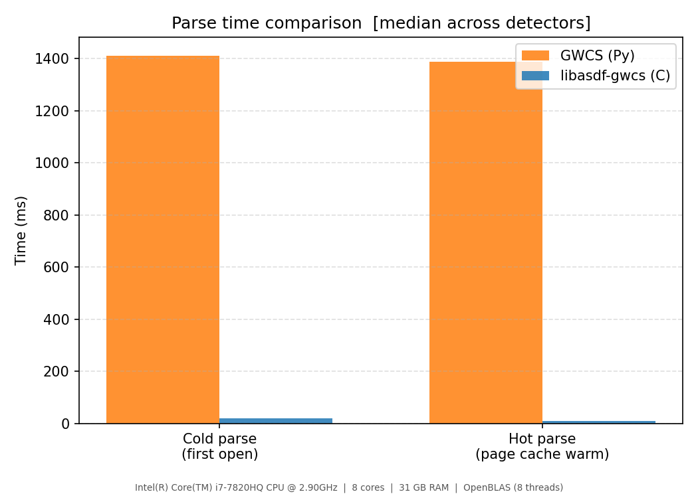
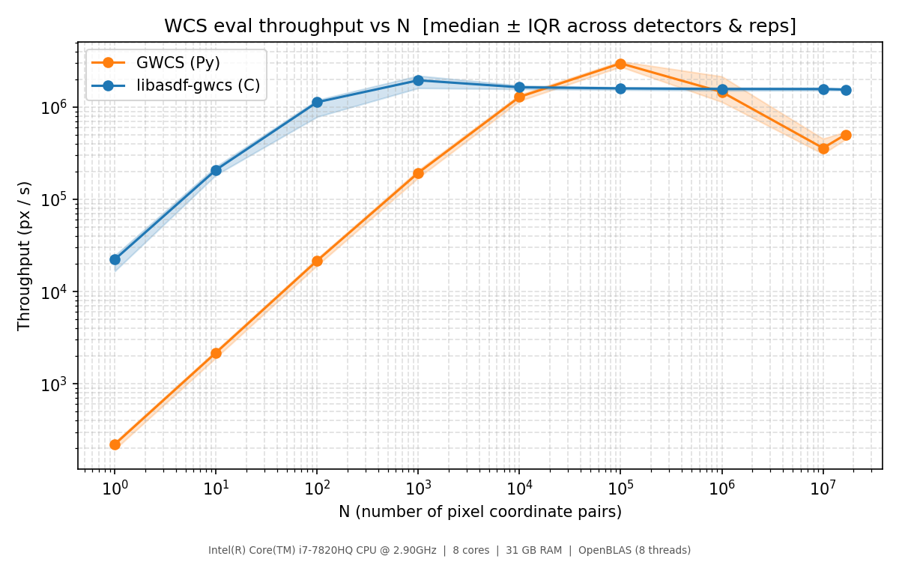
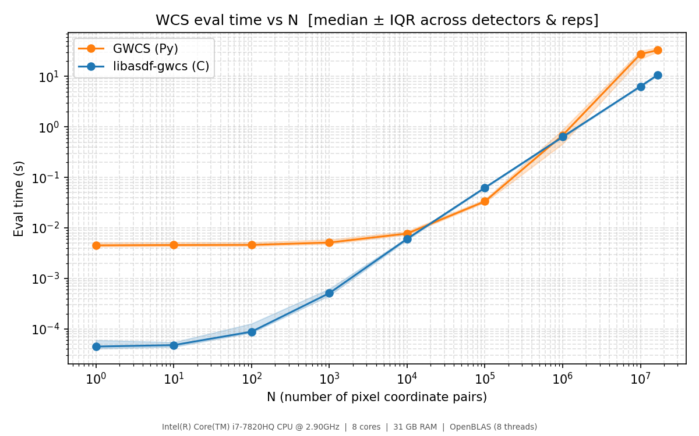
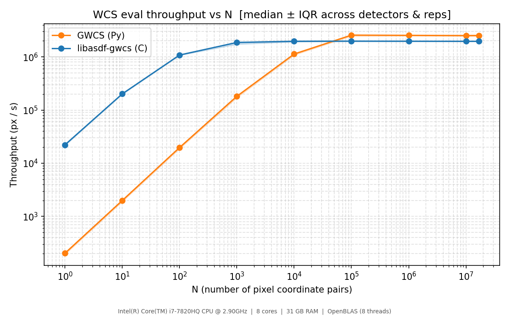
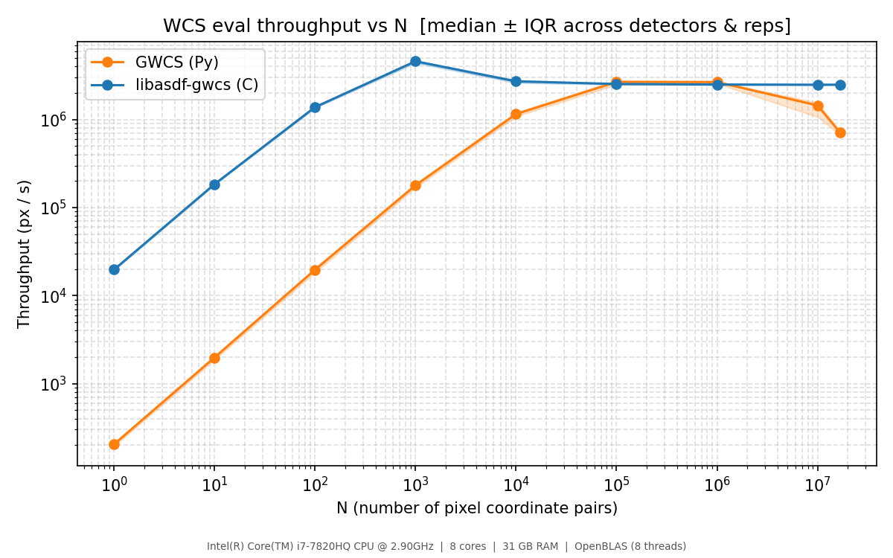
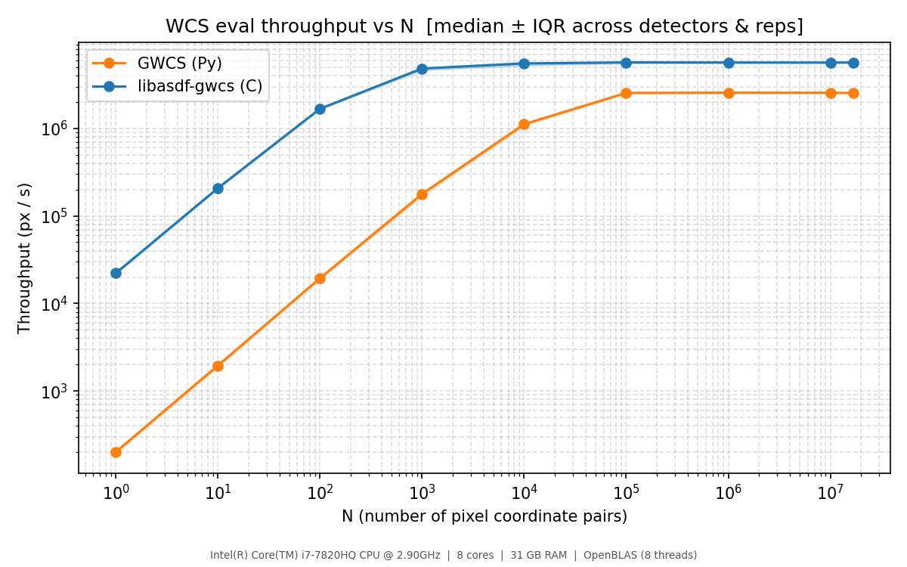

# WCS Evaluation Performance Benchmark

This directory contains tools to benchmark [libasdf-gwcs](../../README.md)
(C) against the Python [GWCS](https://gwcs.readthedocs.io/) library on
real Roman Space Telescope ASDF calibration files.

## What is measured

Three phases are timed per file:

- **parse\_cold** -- open the file, deserialize the WCS tree, and create an
  eval context, with the file first evicted from the OS page cache via
  `POSIX_FADV_DONTNEED` to approximate a cold-cache read.
- **parse\_hot** -- the same sequence immediately after, with the file's pages
  warm in the page cache.
- **eval** -- coordinate evaluation (`asdf_gwcs_eval_2d` / `wcs.pixel_to_world`)
  over N randomly sampled pixel coordinate pairs, for
  N ∈ {1, 10, 100, 1000, 10000, 100000, 1000000, 10000000, 16711744}, with
  multiple repetitions per N. The upper bound (16711744 = 4088 x 4088) is
  the active science area of a single Roman WFI detector (the full array is
  4096 x 4096, with a 4-pixel border of reference pixels on each edge).

All results are written to a CSV in long format
(`library, file, detector, phase, n_points, rep, time_s, blas_threads`).

## Scripts

| Script | Purpose |
|:---|:---|
| `roman_wcs_perf.c` | C benchmark (compiled to `roman_wcs_perf`) |
| `roman_wcs_perf.py` | Python benchmark |
| `summarize.py` | Merge CSVs, print tables, render plots |

### Running

The `Makefile` handles building, running, and plotting.  The most important
variables are:

- `PREFIX` -- installation prefix where libasdf-gwcs is installed
  (default: `~/.local`)
- `DATA_DIR` -- directory containing the Roman `*.asdf` calibration files
  (default: `../roman/.data`)
- `PKG_CONFIG_PATH` -- supplemental pkg-config search path, if libasdf or
  libyaml are not under `PREFIX`

```sh
# Build the C binary, create the Python venv, run both benchmarks, plot:
make PREFIX=/path/to/libasdf-gwcs DATA_DIR=/path/to/asdf/files

# Individual steps:
make build-c       # compile roman_wcs_perf only
make venv          # create Python venv with all dependencies
make run-c         # run C benchmark  -> results/c_perf_results.csv
make run-python    # run Python benchmark -> results/python_perf_results.csv
make plot          # merge CSVs and render plots into results/plots/
make clean         # remove CSVs and plots
make distclean     # also remove venv and compiled binary
```

See the comments at the top of [`Makefile`](Makefile) for the full list of
variables.

## Reference results

Measured on an Intel Core i7-7820HQ laptop (2.90 GHz, 8 cores, 31 GB RAM).
Both libraries run single-threaded and are built with full optimisation
(`-O2` or equivalent).  Python's NumPy links against OpenBLAS, but the
WCS pipeline does not perform matrix operations large enough to trigger
OpenBLAS's internal parallelisation threshold, so multi-threading is not
a factor in these results. Of course, the nature of the problem is such
that it could be easily parallelized.

### Parse times (median across all detectors)

| Phase | GWCS (Py) | libasdf-gwcs (C) |
|:------|---:|---:|
| cold parse | 1410.9 ms | 20.0 ms |
| hot parse | 1386.7 ms | 10.4 ms |



The C library parses roughly **70x faster** than Python in both cases.
The cold/hot difference in C (~10 ms) reflects file I/O almost exclusively.
The Python cold/hot difference varies considerably across runs--in this run
it was unusually small (~24 ms), while earlier runs showed differences of
100 ms or more. It likely reflects a mix of page cache state, internal
caching within astropy/gwcs (unit registries, coordinate frame singletons,
schema validation), and Python interpreter effects. The exact causes have
not been fully investigated; the parse timings should be treated as
approximate.

### Eval throughput (median px/s)

| N | GWCS (Py) | libasdf-gwcs (C) | C/Py |
|--:|---:|---:|---:|
| 1 | 221 | 22,332 | 101.01 |
| 10 | 2,177 | 209,024 | 96.00 |
| 1e2 | 21,656 | 1,132,638 | 52.30 |
| 1e3 | 194,391 | 1,954,881 | 10.06 |
| 1e4 | 1,290,846 | 1,643,255 | 1.27 |
| 1e5 | 2,982,696 | 1,597,975 | 0.54 |
| 1e6 | 1,458,837 | 1,573,563 | 1.08 |
| 1e7 | 359,954 | 1,571,500 | 4.37 |
| 1.7e7 | 504,571 | 1,551,368 | 3.07 |





## Analysis

### Small N: C is dramatically faster

At N=1 and N=10, the C library is **~100x faster**. This regime is dominated
by per-call overhead: Python's function call machinery, object allocation,
argument checking, and the NumPy array creation and ufunc dispatch overhead on
every `pixel_to_world` call. The C library incurs none of this--evaluation is a
direct function call into compiled code with pre-allocated scratch buffers.

This is the most practically important regime for many use cases. Opening a
handful of ASDF files and extracting a small cutout per file (the typical
interactive or pipeline-setup pattern) may involve relatively few coordinate
evaluations per call. In that scenario the C library is faster in every
dimension: parse time is ~70x lower and per-evaluation overhead is ~100x lower.

### Large N: a brief Python window, then C dominates

The two implementations reach parity around N=10,000. NumPy pulls ahead
at N=100,000 (~1.85x faster), which is the only point in the sweep where
Python leads. From N=1,000,000 onward C is faster, and by N=10,000,000
C is **over 4x faster**.

The brief Python advantage around N=100,000 is explained by NumPy's
vectorised ufuncs: once N is large enough to amortise Python call overhead,
NumPy's compiled inner loops outpace AST's scalar per-point evaluation.
The C library evaluates each transform point-by-point via the
[AST](https://github.com/Starlink/ast) library, which does not use SIMD
intrinsics.

The key to C's recovery at large N is that AST evaluates the full pipeline
for one point at a time, so its memory footprint beyond the input/output
arrays is effectively constant (just pipeline coefficients, a few KB).
NumPy, by contrast, materialises each pipeline stage as a complete N-element
intermediate array. For a pipeline with K stages this means approximately
K x N x 8 bytes of working set--at N=10,000,000 with even 10 stages that
is ~800 MB, far exceeding both L3 cache (8 MB) and likely saturating
memory bandwidth. Python's throughput drops precipitously from ~3M px/s at
N=100,000 to ~360K px/s at N=10,000,000 likely for this reason, while C's
throughput remains flat around 1.55M px/s, consistent with a scalar loop
reading/writing four arrays (xin, yin, xout, yout) sequentially from RAM at
a steady rate.

At full active-area scale (N = 4088 x 4088 = 16,711,744 pixels per WFI
detector), C maintains a ~3x throughput advantage over Python.

The NumPy advantage at medium N could be closed by adding SIMD vectorisation
to AST's transform evaluation (see recommendations below); the large-N
advantage is structural and stems from the fundamentally lower memory
footprint of the point-by-point evaluation model.

### Recommendations for closing the medium-N gap

The natural path to eliminating Python's remaining advantage around N=100,000
is to add SIMD vectorisation to AST's transform evaluation:

- **Polynomial transforms**: Horner evaluation is already optimal
  algorithmically; a vectorised implementation (AVX2 or SVE, or compiler
  auto-vectorisation with appropriate hints) would achieve much better
  instruction throughput on large arrays.
- **Affine/matrix transforms**: Replacing scalar loops with `cblas_dgemv` /
  `cblas_dgemm` would match NumPy directly and maybe benefit from
  multi-threaded BLAS at large N.
- **Spherical projection**: The trigonometric operations are memory-bandwidth
  bound at large N; SIMD implementations of `sin`/`cos`/`atan2` (e.g. via
  libmvec or SLEEF) would help here.

These would be contributions to AST itself rather than to libasdf-gwcs.

## Python performance experiments

The large-N Python throughput in the [reference results](#reference-results) was
significantly lower than expected and showed high run-to-run variability.  A series
of experiments investigated the causes and tested mitigations.

### CPU pinning and frequency stability

Initial attempts to reduce variance used `taskset -c 0` to pin both benchmarks
to a single CPU core, and disabled Intel Turbo Boost via
`/sys/devices/system/cpu/intel_pstate/no_turbo` to stabilise clock frequency.
These measures reduced timing scatter but did not materially improve Python's
large-N throughput--the instability had a different root cause.

### NumPy allocation overhead: glibc mmap and minor page faults

The primary cause of Python's poor and variable large-N throughput is glibc's
allocator behaviour for large arrays.

Each call to `wcs.pixel_to_world` allocates and frees a series of N-element
intermediate arrays (one per pipeline stage).  Once an array exceeds glibc's
`M_MMAP_THRESHOLD` (128 KB by default), `malloc()` routes the request to
`mmap(MAP_ANONYMOUS)` rather than the brk-based heap.  When `free()` calls
`munmap()`, the virtual and physical mapping is destroyed.  The next allocation
of similar size receives a fresh virtual address with no page table entry, so
every element access causes a **minor page fault**--a kernel trap to install a
PTE, with no disk I/O involved but still measurable overhead.  At
N = 10,000,000, this amounts to roughly 300,000 minor faults per
`pixel_to_world` call, contributing several seconds of kernel overhead per
repetition.

I believe run-to-run variability arose from glibc's dynamic threshold: glibc
automatically raises `M_MMAP_THRESHOLD` when it observes large mmap'd chunks
being freed, sometimes pushing it above 80 MB automatically (producing a fast
run) but inconsistently (making the next run slow).

**`mallopt` workaround (partial).** The `--fast-malloc` flag in
`roman_wcs_perf.py` calls `mallopt(M_MMAP_THRESHOLD, 256 MB)` before the eval
sweep, and `mallopt(M_TRIM_THRESHOLD, 512 MB)` to prevent glibc from trimming
the brk heap between N levels.  On 64-bit Linux, however, glibc silently caps
`M_MMAP_THRESHOLD` at
`DEFAULT_MMAP_THRESHOLD_MAX = 4 x 1024 x 1024 x sizeof(long)` = **32 MB**.
Arrays at N >= ~4,000,000 (32 MB / 8 bytes/element) therefore still go through
mmap/munmap.  The workaround eliminates faults for smaller intermediate
arrays but cannot prevent them for the large arrays that dominate at
N = 10M–16.7M.  A further complication: as N grows from 10M to 16.7M,
additional intermediate arrays cross the 32 MB threshold, so fault counts grow
faster than N (observed: 3.4x more faults for only 1.67x more data).

### jemalloc

[jemalloc](https://jemalloc.net/) manages its own pool of large memory extents
and avoids `mmap`/`munmap` per allocation.  Instead of unmapping freed extents
it marks them with `madvise(MADV_DONTNEED)` (returning physical pages to the OS
while keeping the virtual mapping), avoiding the TLB shootdown and kernel VMA
management cost of `munmap`.  Repeated allocations of similar size reuse the
same virtual address range.

For this experiment both benchmarks were run under jemalloc via `LD_PRELOAD`,
with page decommitting disabled entirely:

```sh
MALLOC_CONF=dirty_decay_ms:-1,muzzy_decay_ms:-1 \
LD_PRELOAD=/usr/lib/x86_64-linux-gnu/libjemalloc.so.2 \
    ./roman_wcs_perf -o results/jemalloc/c_perf_results.csv *.asdf

MALLOC_CONF=dirty_decay_ms:-1,muzzy_decay_ms:-1 \
LD_PRELOAD=/usr/lib/x86_64-linux-gnu/libjemalloc.so.2 \
    python3 roman_wcs_perf.py --fast-malloc \
        -o results/jemalloc/python_perf_results.csv *.asdf
```

`dirty_decay_ms:-1` disables `MADV_DONTNEED` on dirty (recently freed) extents;
`muzzy_decay_ms:-1` disables `MADV_FREE` on muzzy (speculatively retained)
extents. With both flags set, physical pages are never returned to the OS
between allocations, so repeated allocations of the same size incur page faults
only the first time jemalloc extends a new extent.  The trade-off is peak RSS:
by the end of the N = 16,711,744 level the Python process retains roughly 4 GB
of jemalloc-managed heap.  Because that pool grows monotonically, later files
in the benchmark (which reuse already-faulted extents) show lower fault counts
and higher throughput than the first file.

jemalloc makes little difference to the C benchmark--libasdf-gwcs pre-allocates
coordinate buffers once at startup and AST's internal working memory is
relatively modest, so there is no repeated large-allocation pressure during the
eval sweep.

#### Results (jemalloc)

| Phase | GWCS (Py) | libasdf-gwcs (C) |
|:------|---:|---:|
| cold parse | 824.9 ms | 37.9 ms |
| hot parse | 563.0 ms | 28.7 ms |

| N | GWCS (Py) | libasdf-gwcs (C) | C/Py |
|--:|---:|---:|---:|
| 1 | 203 | 22,220 | 109.34 |
| 10 | 1,990 | 201,564 | 101.29 |
| 1e2 | 19,712 | 1,082,972 | 54.94 |
| 1e3 | 181,217 | 1,865,874 | 10.30 |
| 1e4 | 1,129,961 | 1,962,031 | 1.74 |
| 1e5 | 2,562,569 | 1,975,831 | 0.77 |
| 1e6 | 2,539,806 | 1,968,526 | 0.78 |
| 1e7 | 2,517,166 | 1,962,383 | 0.78 |
| 1.7e7 | 2,527,470 | 1,960,801 | 0.78 |



With jemalloc and page decommitting disabled, Python's throughput at large N
rises from roughly 650K px/s to ~2.5M px/s and is essentially flat from
N = 100,000 onward.  The large-N collapse seen in the earlier reference
results is an allocator artefact, not a fundamental property of the GWCS
pipeline.  At N >= 100,000 Python's throughput still (~2.5M px/s) slightly
exceeds that of the (non-SIMD) libasdf-gwcs build (~1.96M px/s), indicating
that NumPy's vectorised ufuncs have better raw throughput than AST's scalar
point-by-point evaluation once allocation overhead is eliminated.

## SIMD vectorisation in AST

The recommendations above were acted on. Experimental SIMD evaluation support
for three key transform types was added to AST and submitted as
[pull request #51](https://github.com/Starlink/ast/pull/51):

- **PolyMap** (polynomial transforms): Horner evaluation restructured to
  process all N input points per coefficient, making the inner loop
  auto-vectorisable by GCC. On AVX2 hardware this processes four doubles
  per cycle.
- **MatrixMap** (matrix transforms, including rotations): the matrix-vector
  multiply loop vectorised; this transform accounted for roughly 16% of
  total pipeline instruction count before the change (measured by callgrind).
- **SphMap** (spherical <-> Cartesian): trigonometric operations (`sin`,
  `cos`, `atan2`) replaced by libmvec vectorised equivalents via GCC
  auto-vectorisation with `-ffast-math`.

### Results (SIMD C build, glibc + --fast-malloc)

Standard conditions: glibc allocator with `--fast-malloc` on the Python side
(same as used for the reference results), SIMD C binary built against the
SIMD branch of AST.

| Phase | GWCS (Py) | libasdf-gwcs (C) |
|:------|---:|---:|
| cold parse | 853.3 ms | 19.4 ms |
| hot parse | 613.6 ms | 11.2 ms |

| N | GWCS (Py) | libasdf-gwcs (C) | C/Py |
|--:|---:|---:|---:|
| 1 | 205 | 19,709 | 96.37 |
| 10 | 1,979 | 184,077 | 93.00 |
| 1e2 | 19,657 | 1,381,540 | 70.28 |
| 1e3 | 178,978 | 4,585,284 | 25.62 |
| 1e4 | 1,153,844 | 2,716,078 | 2.35 |
| 1e5 | 2,670,879 | 2,530,143 | 0.95 |
| 1e6 | 2,663,465 | 2,496,934 | 0.94 |
| 1e7 | 1,445,047 | 2,481,963 | 1.72 |
| 1.7e7 | 713,184 | 2,486,192 | 3.49 |



The SIMD C build reaches ~2.5M px/s at large N, compared to ~1.57M px/s for
the non-SIMD reference build -- roughly a **1.6x improvement** from
vectorisation.  At N = 100,000 and N = 1,000,000 C and Python are essentially
tied; the brief Python advantage seen in the non-SIMD reference results is
eliminated.  At N >= 10,000,000, Python's throughput collapses again due to
the glibc mmap allocation issue described above (the `--fast-malloc` workaround
is only partially effective; see [Python performance experiments](#python-performance-experiments)).

### Results with jemalloc (both C and Python)

For completeness, the same SIMD C build was also run alongside the Python
benchmark under jemalloc (`MALLOC_CONF=dirty_decay_ms:-1,muzzy_decay_ms:-1`),
following the same methodology as the [jemalloc section above](#jemalloc).
This removes Python's allocation overhead, allowing a cleaner comparison of
raw pipeline throughput.

| Phase | GWCS (Py) | libasdf-gwcs (C) |
|:------|---:|---:|
| cold parse | 825.8 ms | 37.8 ms |
| hot parse | 549.2 ms | 28.6 ms |

| N | GWCS (Py) | libasdf-gwcs (C) | C/Py |
|--:|---:|---:|---:|
| 1 | 201 | 22,175 | 110.44 |
| 10 | 1,951 | 207,788 | 106.49 |
| 1e2 | 19,407 | 1,674,187 | 86.27 |
| 1e3 | 177,820 | 4,831,840 | 27.17 |
| 1e4 | 1,114,818 | 5,516,869 | 4.95 |
| 1e5 | 2,540,755 | 5,671,545 | 2.23 |
| 1e6 | 2,556,520 | 5,654,804 | 2.21 |
| 1e7 | 2,550,335 | 5,644,214 | 2.21 |
| 1.7e7 | 2,543,704 | 5,654,381 | 2.22 |



With jemalloc eliminating Python's allocation overhead, the C/Py ratio
stabilises at ~2.22 from N = 100,000 onward and remains flat across all larger
N.  The SIMD C build reaches ~5.65M px/s, compared to ~1.96M px/s for the
non-SIMD build under the same jemalloc conditions -- a **~2.9x improvement**
attributable to vectorisation.  The SIMD build is faster than Python at every
N above ~10,000.

## History

This is a living document updated as new benchmark runs are performed.

### 2026-06-03

Experimental SIMD vectorisation added to AST for PolyMap, MatrixMap, and
SphMap (see [PR #51](https://github.com/Starlink/ast/pull/51)).  Under
standard conditions (glibc + `--fast-malloc`) the SIMD C build reaches
~2.5M px/s at large N (~1.6x improvement over non-SIMD).  Under jemalloc,
it reaches ~5.65M px/s (~2.9x over the non-SIMD jemalloc baseline).
Results committed to `results/simd/` and `results/simd-jemalloc/`.

**Software versions:** same as 2026-06-02, built against the SIMD branch of
AST (pre-merge of PR #51).

### 2026-06-02

Investigation into the root cause of Python's poor and variable large-N
throughput. The primary cause was identified as glibc routing large NumPy
intermediate-array allocations through `mmap(MAP_ANONYMOUS)` / `munmap()`,
causing hundreds of thousands of minor page faults per `pixel_to_world` call.
A `mallopt` workaround (`--fast-malloc` flag) provides partial relief but is
limited by the 32 MB `DEFAULT_MMAP_THRESHOLD_MAX` cap on 64-bit glibc.
Running both benchmarks under jemalloc with
`MALLOC_CONF=dirty_decay_ms:-1,muzzy_decay_ms:-1` eliminates the large-N
throughput collapse; Python reaches ~2.5M px/s flat from N = 100,000 onward,
slightly exceeding the non-SIMD C build at large N.  Results committed to
`results/jemalloc/`.

Additional benchmark hygiene changes in this session: bounding-box checking 
disabled by default in the Python benchmark (matching libasdf-gwcs/AST
behaviour).

**Software versions:** same as 2026-05-26, plus jemalloc 5.3.0.

### 2026-05-26

First fully optimised benchmark run: both libasdf-gwcs and libasdf confirmed
built with `-O2` (previous runs may have inadvertently used debug flags on
libasdf).  The N sweep was extended to cover 10,000,000 and 16,711,744
(= 4088 x 4088, the active science area of a single Roman Wide Field
Instrument detector; the full array is 4096 x 4096 with a 4-pixel reference
pixel border on each edge), confirming that the C library maintains a 3-4x
throughput advantage over Python at full-detector scale where NumPy's per-stage
intermediate array allocation exhausts memory bandwidth.

**Software versions:**

| Component | Version |
|:---|:---|
| libasdf-gwcs | [a8ce6e91](https://github.com/asdf-format/libasdf-gwcs/commit/a8ce6e91b701c0b0f06e86bc796ec5fe75ddfef9) |
| libasdf | [02c375ee](https://github.com/asdf-format/libasdf/commit/02c375ee2fbd6ce5c921d6e1ad3b09815ffd8c19) |
| libfyaml | 1.0.0-alpha4 |
| Python | 3.12.3 |
| NumPy | 2.4.6 |
| asdf (Python) | 5.3.0 |
| astropy | 7.2.0 |
| gwcs | 1.0.3 |
